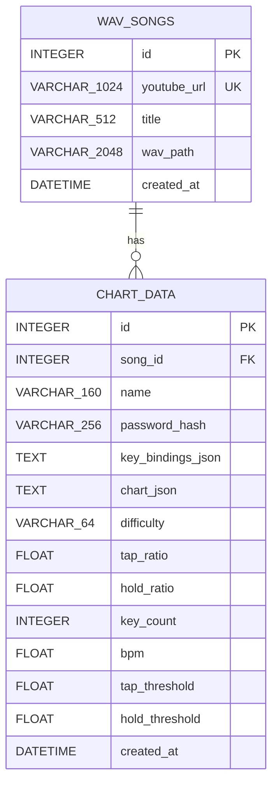

# Rhythm AI ERD

## Relationship

- `WAV_SONGS.id` -> `CHART_DATA.song_id`
- One song can have zero or more charts.
- Deleting a song deletes its associated charts through the SQLAlchemy relationship.
- `WAV_SONGS.youtube_url` is unique.
