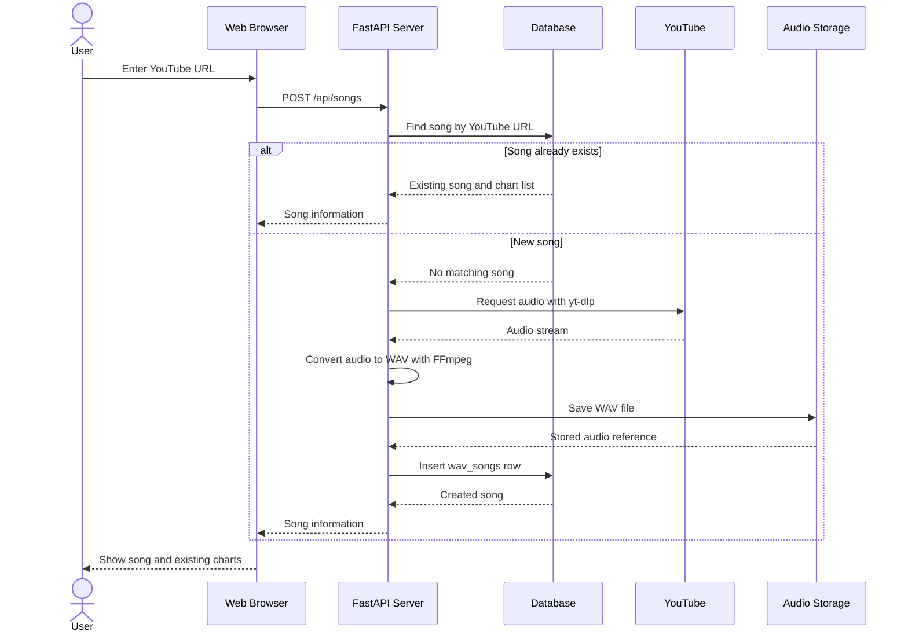
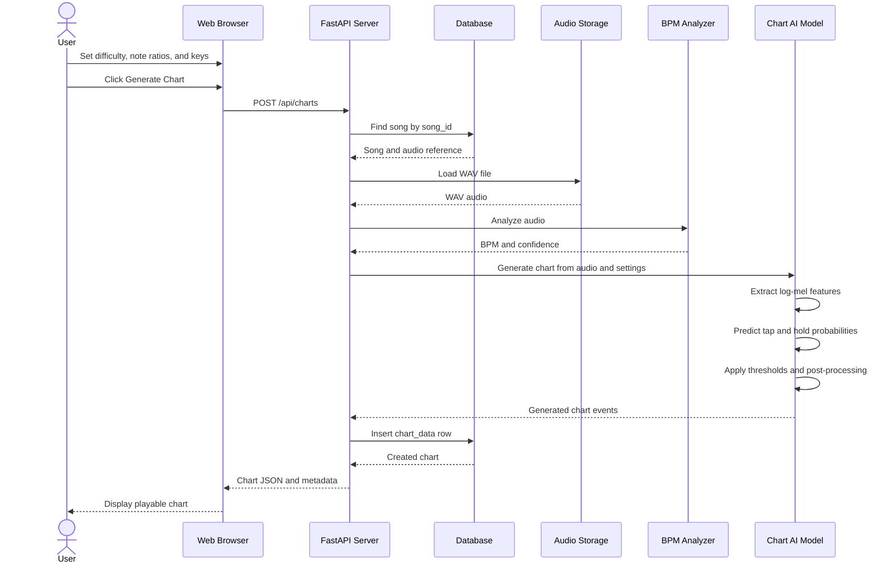
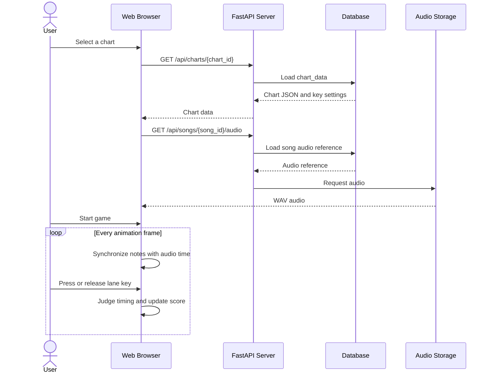
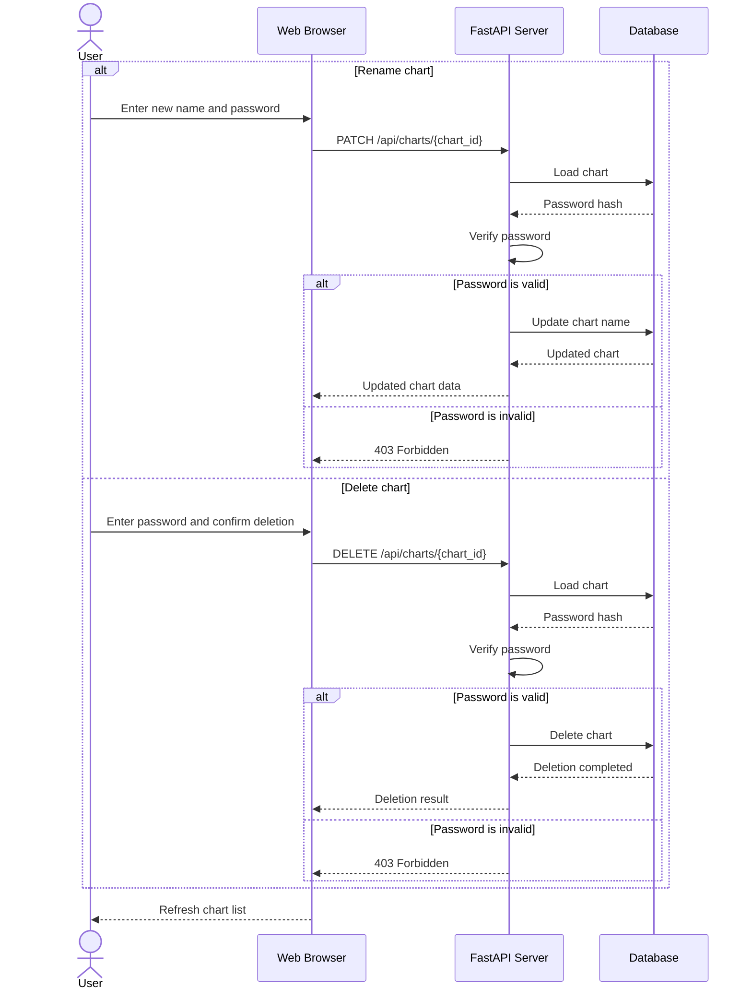

# Rhythm AI Sequence Diagrams

## 1. Song Registration

```mermaid
sequenceDiagram
    actor User
    participant Web as Web Browser
    participant API as FastAPI Server
    participant DB as Database
    participant YouTube
    participant Storage as Audio Storage

    User->>Web: Enter YouTube URL
    Web->>API: POST /api/songs
    API->>DB: Find song by YouTube URL

    alt Song already exists
        DB-->>API: Existing song and chart list
        API-->>Web: Song information
    else New song
        DB-->>API: No matching song
        API->>YouTube: Request audio with yt-dlp
        YouTube-->>API: Audio stream
        API->>API: Convert audio to WAV with FFmpeg
        API->>Storage: Save WAV file
        Storage-->>API: Stored audio reference
        API->>DB: Insert wav_songs row
        DB-->>API: Created song
        API-->>Web: Song information
    end

    Web-->>User: Show song and existing charts
```

## 2. Chart Generation

```mermaid
sequenceDiagram
    actor User
    participant Web as Web Browser
    participant API as FastAPI Server
    participant DB as Database
    participant Storage as Audio Storage
    participant BPM as BPM Analyzer
    participant AI as Chart AI Model

    User->>Web: Set difficulty, note ratios, and keys
    User->>Web: Click Generate Chart
    Web->>API: POST /api/charts
    API->>DB: Find song by song_id
    DB-->>API: Song and audio reference
    API->>Storage: Load WAV file
    Storage-->>API: WAV audio
    API->>BPM: Analyze audio
    BPM-->>API: BPM and confidence
    API->>AI: Generate chart from audio and settings
    AI->>AI: Extract log-mel features
    AI->>AI: Predict tap and hold probabilities
    AI->>AI: Apply thresholds and post-processing
    AI-->>API: Generated chart events
    API->>DB: Insert chart_data row
    DB-->>API: Created chart
    API-->>Web: Chart JSON and metadata
    Web-->>User: Display playable chart
```

## 3. Chart Playback

```mermaid
sequenceDiagram
    actor User
    participant Web as Web Browser
    participant API as FastAPI Server
    participant DB as Database
    participant Storage as Audio Storage

    User->>Web: Select a chart
    Web->>API: GET /api/charts/{chart_id}
    API->>DB: Load chart_data
    DB-->>API: Chart JSON and key settings
    API-->>Web: Chart data

    Web->>API: GET /api/songs/{song_id}/audio
    API->>DB: Load song audio reference
    DB-->>API: Audio reference
    API->>Storage: Request audio
    Storage-->>Web: WAV audio

    User->>Web: Start game
    loop Every animation frame
        Web->>Web: Synchronize notes with audio time
        User->>Web: Press or release lane key
        Web->>Web: Judge timing and update score
    end
```

## 4. Chart Management

```mermaid
sequenceDiagram
    actor User
    participant Web as Web Browser
    participant API as FastAPI Server
    participant DB as Database

    alt Rename chart
        User->>Web: Enter new name and password
        Web->>API: PATCH /api/charts/{chart_id}
        API->>DB: Load chart
        DB-->>API: Password hash
        API->>API: Verify password

        alt Password is valid
            API->>DB: Update chart name
            DB-->>API: Updated chart
            API-->>Web: Updated chart data
        else Password is invalid
            API-->>Web: 403 Forbidden
        end
    else Delete chart
        User->>Web: Enter password and confirm deletion
        Web->>API: DELETE /api/charts/{chart_id}
        API->>DB: Load chart
        DB-->>API: Password hash
        API->>API: Verify password

        alt Password is valid
            API->>DB: Delete chart
            DB-->>API: Deletion completed
            API-->>Web: Deletion result
        else Password is invalid
            API-->>Web: 403 Forbidden
        end
    end

    Web-->>User: Refresh chart list
```
